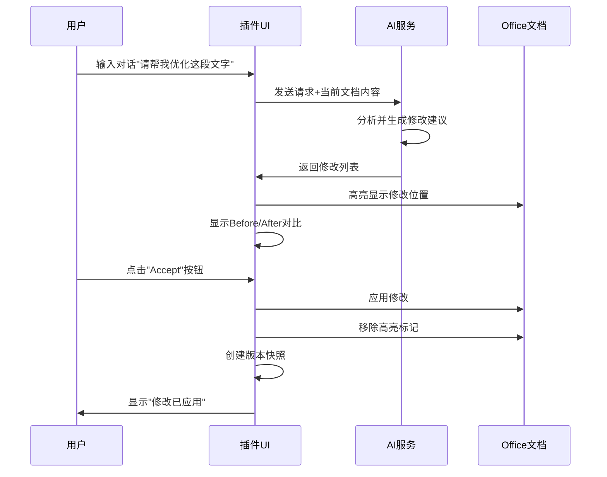

# Office AI 插件 UI/UX 设计方案

> 基于 Augment AI 编辑器设计理念的 Office 文档可视化反馈系统

---

## ⚠️ 重要技术约束

> **禁止使用Word的Track Changes功能**

经过实际测试,Word的Track Changes (修订追踪) API **完全不可用**,存在严重的技术问题和限制。

**本设计方案采用的技术路线**:
- ✅ **ContentControl + 自定义高亮**: 所有Word文档的修改可视化
- ✅ **自定义ChangeManager**: 完全自主的修改追踪逻辑
- ✅ **自定义VersionManager**: 版本快照和回滚功能
- ❌ **不使用Track Changes API**: 不依赖Office原生的修订追踪

详见 [4.1 技术方案说明](#41-技术方案说明) 和 [11.1 难点1: Word Track Changes不可用](#111-难点1-word-track-changes不可用)

---

## 📋 目录

1. [调研总结](#调研总结)
2. [核心设计理念](#核心设计理念)
3. [整体架构设计](#整体架构设计)
4. [Word 文档可视化方案](#word-文档可视化方案)
5. [Excel 表格可视化方案](#excel-表格可视化方案)
6. [PowerPoint 幻灯片可视化方案](#powerpoint-幻灯片可视化方案)
7. [交互流程设计](#交互流程设计)
8. [技术实现方案](#技术实现方案)
9. [组件开发清单](#组件开发清单)

---

## 1. 调研总结

### 1.1 Augment AI 编辑器的核心特性

基于对 Augment Code 官网和相关资料的调研,发现以下关键设计模式:

#### ✅ **Code Checkpoints(代码检查点)**
- **自动变更追踪**: 每次AI修改都会自动创建检查点
- **轻松回滚**: 用户可以一键回滚到任何历史版本
- **保持编程风格**: 追踪并维护用户的代码风格

#### ✅ **Diff Interface(差异对比界面)**
- **交互式源文件编辑**: 使用diff界面进行交互式编辑
- **多阶段代码编辑流程**: 支持多轮修改和迭代
- **可视化变更**: 清晰展示修改前后的对比

#### ✅ **Agent 工作流程**
- **Memories & Context**: AI记住用户的工作模式和代码风格
- **Multi-Modal**: 支持截图、Figma文件等多种输入
- **Native Tools & MCPs**: 集成GitHub、Jira等工具

### 1.2 代码Diff可视化最佳实践

#### **Side-by-Side View(并排视图)**
- 左侧显示原始代码,右侧显示修改后代码
- 适合查看大范围修改
- VSCode、GitHub等主流工具的标准模式

#### **Inline/Unified View(内联/统一视图)**
- 在同一视图中显示删除(红色)和添加(绿色)
- 适合查看小范围修改
- 节省屏幕空间

#### **Monaco Editor**
- VSCode使用的编辑器组件
- 原生支持diff视图
- 可嵌入到Web应用中

### 1.3 Office.js API 能力分析

#### **Word API**
- ✅ `ContentControl`: 可以标记和高亮文本区域(核心方案)
- ✅ `Range`: 选择和操作文本范围
- ✅ `Annotation`: WordApi 1.7引入,支持批注
- ✅ `Compare`: 文档对比功能
- ⚠️ `Track Changes`: **已测试不可用,不采用此方案**

#### **Excel API**
- ✅ `ConditionalFormat`: 条件格式化,高亮单元格
- ✅ `Range.format`: 设置单元格格式(颜色、字体等)
- ✅ `Comment`: 添加批注
- ⚠️ 性能问题: 批量写入格式时需要优化

#### **PowerPoint API**
- ✅ `Shape`: 操作形状对象
- ✅ `Slide`: 操作幻灯片
- ⚠️ 没有直接的selection highlight API
- 💡 可以通过添加半透明形状实现高亮效果

---

## 2. 核心设计理念

### 2.1 设计原则

#### 🎯 **直观性优先**
> "用户应该一眼就能看出文档哪里被修改了"

- 使用颜色编码区分修改类型(新增/删除/修改)
- 提供清晰的视觉标记(高亮、边框、图标)
- 支持快速定位到修改位置

#### 🔄 **可逆性保证**
> "所有修改都可以轻松撤销"

- 每次AI修改都创建版本快照
- 提供Accept/Reject按钮
- 支持批量接受或拒绝修改
- 保留完整的修改历史

#### 📊 **上下文感知**
> "展示修改的原因和影响"

- 显示AI修改的理由
- 展示修改前后的对比
- 提供相关的上下文信息

#### ⚡ **性能优化**
> "即使大文档也能流畅操作"

- 增量渲染修改标记
- 延迟加载历史版本
- 优化Office.js API调用

### 2.2 适配Office场景的关键差异

| 特性 | 代码编辑器(Augment) | Office文档(我们的插件) |
|------|---------------------|------------------------|
| **内容单位** | 行(Line) | 段落/单元格/幻灯片 |
| **修改粒度** | 字符级别 | 段落/单元格/元素级别 |
| **可视化方式** | 文本diff | 富文本/表格/图形diff |
| **原生支持** | 无 | ContentControl自定义高亮 |
| **用户习惯** | 开发者 | 办公用户 |

---

## 3. 整体架构设计

### 3.1 界面布局

```
┌─────────────────────────────────────────────────────────────┐
│  Office 应用窗口 (Word/Excel/PowerPoint)                      │
├──────────────────────────────┬──────────────────────────────┤
│                              │                              │
│                              │  ┌────────────────────────┐  │
│                              │  │  AI 对话面板           │  │
│                              │  │  ┌──────────────────┐  │  │
│                              │  │  │ 用户: 请帮我...  │  │  │
│      文档编辑区域              │  │  │ AI: 我将修改...  │  │  │
│                              │  │  └──────────────────┘  │  │
│  ┌────────────────────────┐  │  └────────────────────────┘  │
│  │ 修改建议 #1            │  │                              │
│  │ [Accept] [Reject]      │  │  ┌────────────────────────┐  │
│  └────────────────────────┘  │  │  修改预览面板          │  │
│                              │  │  ┌──────────────────┐  │  │
│  ┌────────────────────────┐  │  │  │ Before | After   │  │  │
│  │ 修改建议 #2            │  │  │  │ ──────────────── │  │  │
│  │ [Accept] [Reject]      │  │  │  │ 原文   | 修改后  │  │  │
│  └────────────────────────┘  │  │  └──────────────────┘  │  │
│                              │  └────────────────────────┘  │
│                              │                              │
│                              │  ┌────────────────────────┐  │
│                              │  │  版本历史              │  │
│                              │  │  • v3 (当前)          │  │
│                              │  │  • v2 [Restore]       │  │
│                              │  │  • v1 [Restore]       │  │
│                              │  └────────────────────────┘  │
└──────────────────────────────┴──────────────────────────────┘
```

### 3.2 核心组件

#### **1. AI对话面板 (ChatPanel)**
- 用户输入对话框
- AI响应显示区域
- 历史对话记录

#### **2. 修改预览面板 (DiffPreviewPanel)**
- Before/After对比视图
- 高亮显示修改内容
- 支持Side-by-Side和Inline两种模式

#### **3. 修改建议列表 (ChangesList)**
- 显示所有待处理的修改
- 每个修改项包含Accept/Reject按钮
- 支持批量操作

#### **4. 版本历史面板 (VersionHistory)**
- 显示所有历史版本
- 支持版本对比
- 一键恢复到历史版本

#### **5. 文档高亮层 (DocumentHighlightLayer)**
- 在文档中直接标记修改位置
- 使用Office.js API实现
- 不同颜色表示不同修改类型

---

## 4. Word 文档可视化方案

### 4.1 技术方案说明

> ⚠️ **重要约束: 禁止使用Track Changes功能**

经过实际测试,我们发现Word的Track Changes (修订追踪) API存在以下严重问题:

#### **为什么不使用Track Changes?**

1. **技术问题**
   - ❌ API调用不稳定,存在兼容性问题
   - ❌ 无法精确控制修订的创建和管理
   - ❌ 与Office.js的其他API存在冲突

2. **功能限制**
   - ❌ 无法自定义修订的样式和颜色
   - ❌ 无法实现我们需要的细粒度控制
   - ❌ 用户可能会手动关闭Track Changes,导致功能失效

3. **用户体验问题**
   - ❌ 会干扰用户自己的修订追踪设置
   - ❌ 无法区分AI修改和用户手动修改
   - ❌ 接受/拒绝修改的流程不够直观

#### **我们的解决方案: ContentControl + 自定义管理**

✅ **完全自主可控**: 所有修改追踪逻辑由我们的插件实现
✅ **灵活的样式**: 可以自定义颜色、边框、图标等
✅ **精确的管理**: 通过ChangeManager精确管理每个修改
✅ **版本快照**: 通过VersionManager实现完整的版本控制
✅ **不干扰用户**: 不影响用户自己的文档设置

### 4.2 修改类型定义

| 修改类型 | 颜色标记 | 视觉效果 | Office.js实现 |
|---------|---------|---------|--------------|
| **新增段落** | 🟢 绿色背景 | 左侧绿色竖线 | `ContentControl` + 绿色背景 |
| **删除段落** | 🔴 红色删除线 | 左侧红色竖线 | `ContentControl` + 删除线 |
| **修改段落** | 🟡 黄色背景 | 左侧黄色竖线 | `ContentControl` + 黄色背景 |
| **格式修改** | 🔵 蓝色边框 | 虚线边框 | `ContentControl` + 蓝色边框 |

### 4.2 段落级别Diff展示

#### **实现方案: 使用ContentControl标记**

> ⚠️ **重要说明**: 经过实际测试,Word的Track Changes API存在严重问题,完全不可用。我们采用ContentControl + 自定义高亮的方案来实现所有修改追踪功能。

```typescript
// 标记新增段落
async function markAddedParagraph(paragraphIndex: number) {
  await Word.run(async (context) => {
    const paragraph = context.document.body.paragraphs.items[paragraphIndex];
    const contentControl = paragraph.insertContentControl();

    // 设置样式
    contentControl.appearance = "BoundingBox";
    contentControl.color = "#E8F5E9"; // 浅绿色背景
    contentControl.tag = "AI_ADDED";
    contentControl.title = "AI新增内容";

    // 添加左侧绿色竖线效果(通过边框实现)
    contentControl.font.highlightColor = "#4CAF50";

    await context.sync();
  });
}

// 标记删除段落
async function markDeletedParagraph(paragraphIndex: number) {
  await Word.run(async (context) => {
    const paragraph = context.document.body.paragraphs.items[paragraphIndex];
    const contentControl = paragraph.insertContentControl();

    contentControl.appearance = "BoundingBox";
    contentControl.color = "#FFEBEE"; // 浅红色背景
    contentControl.tag = "AI_DELETED";
    contentControl.title = "AI删除内容";

    // 添加删除线效果
    contentControl.font.strikeThrough = true;
    contentControl.font.color = "#F44336";

    await context.sync();
  });
}

// 标记修改段落
async function markModifiedParagraph(paragraphIndex: number) {
  await Word.run(async (context) => {
    const paragraph = context.document.body.paragraphs.items[paragraphIndex];
    const contentControl = paragraph.insertContentControl();

    contentControl.appearance = "BoundingBox";
    contentControl.color = "#FFF9C4"; // 浅黄色背景
    contentControl.tag = "AI_MODIFIED";
    contentControl.title = "AI修改内容";

    await context.sync();
  });
}
```

### 4.3 Accept/Reject交互流程

```typescript
class WordChangeManager {
  private changes: Map<string, PendingChange> = new Map();

  // 接受修改
  async acceptChange(changeId: string) {
    const change = this.changes.get(changeId);
    if (!change) return;

    await Word.run(async (context) => {
      const contentControls = context.document.contentControls;
      contentControls.load("items");
      await context.sync();

      const targetCC = contentControls.items.find(cc => cc.tag === changeId);
      if (targetCC) {
        targetCC.delete(false); // 保留内容,只删除标记
      }

      await context.sync();
    });

    this.changes.delete(changeId);
  }
}
```

---

## 5. Excel 表格可视化方案

### 5.1 修改类型定义

| 修改类型 | 颜色标记 | 视觉效果 | Office.js实现 |
|---------|---------|---------|--------------|
| **新增行/列** | 🟢 绿色背景 | 整行/列绿色 | `Range.format.fill` |
| **删除行/列** | 🔴 红色删除线 | 整行/列红色 | `Range.format.fill` + 删除线 |
| **修改单元格** | 🟡 黄色背景 | 单元格黄色 | `ConditionalFormat` |
| **公式修改** | 🔵 蓝色边框 | 蓝色边框 | `Range.format.borders` |

### 5.2 单元格级别Diff展示

```typescript
async function highlightModifiedCells(changes: CellChange[]) {
  await Excel.run(async (context) => {
    const sheet = context.workbook.worksheets.getActiveWorksheet();

    for (const change of changes) {
      const range = sheet.getRange(change.address);

      // 根据修改类型设置不同颜色
      const color = change.type === 'add' ? '#E8F5E9' :
                    change.type === 'delete' ? '#FFEBEE' :
                    '#FFF9C4';

      range.format.fill.color = color;
      range.addComment(`AI修改: ${change.description}`);
    }

    await context.sync();
  });
}
```

### 5.3 批量操作优化

```typescript
class ExcelChangeManager {
  // 批量接受修改(优化性能)
  async acceptAllChanges() {
    await Excel.run(async (context) => {
      const sheet = context.workbook.worksheets.getActiveWorksheet();

      for (const [id, change] of this.changes) {
        const range = sheet.getRange(change.address);
        range.values = [[change.newValue]];
        range.format.fill.clear(); // 清除高亮
      }

      await context.sync();
      this.changes.clear();
    });
  }
}
```

---

## 6. PowerPoint 幻灯片可视化方案

### 6.1 修改类型定义

| 修改类型 | 颜色标记 | 视觉效果 | Office.js实现 |
|---------|---------|---------|--------------|
| **新增幻灯片** | 🟢 绿色边框 | 缩略图绿色边框 | 侧边栏标记 |
| **删除幻灯片** | 🔴 红色边框 | 缩略图红色边框 | 侧边栏标记 |
| **修改元素** | 🟡 黄色高亮 | 元素黄色边框 | 半透明形状叠加 |
| **布局修改** | 🔵 蓝色边框 | 整页蓝色边框 | 侧边栏标记 |

### 6.2 元素级别Diff展示

```typescript
async function highlightModifiedShape(slideIndex: number, shapeId: string) {
  await PowerPoint.run(async (context) => {
    const slide = context.presentation.slides.getItemAt(slideIndex);
    const shape = slide.shapes.getItem(shapeId);

    // 添加半透明黄色矩形作为高亮
    const highlight = slide.shapes.addGeometricShape(
      PowerPoint.GeometricShapeType.rectangle
    );

    // 设置位置和大小与原形状相同
    shape.load("left,top,width,height");
    await context.sync();

    highlight.left = shape.left;
    highlight.top = shape.top;
    highlight.width = shape.width;
    highlight.height = shape.height;

    // 设置样式
    highlight.fill.setSolidColor("#FFF9C4");
    highlight.fill.transparency = 0.5;
    highlight.lineFormat.color = "#FBC02D";
    highlight.lineFormat.weight = 2;

    await context.sync();
  });
}
```

---

## 7. 交互流程设计

### 7.1 完整的用户交互流程



### 7.2 修改建议的生命周期

```
┌─────────────────────────────────────────────────────────────┐
│  修改建议生命周期                                             │
├─────────────────────────────────────────────────────────────┤
│                                                             │
│  1. [Pending] 待处理                                         │
│     ↓                                                       │
│     • 在文档中高亮显示                                        │
│     • 在侧边栏显示详情                                        │
│     • 提供Accept/Reject按钮                                  │
│                                                             │
│  2. [Accepted] 已接受                                        │
│     ↓                                                       │
│     • 应用修改到文档                                          │
│     • 移除高亮标记                                            │
│     • 创建版本快照                                            │
│     • 移动到历史记录                                          │
│                                                             │
│  3. [Rejected] 已拒绝                                        │
│     ↓                                                       │
│     • 移除高亮标记                                            │
│     • 保持文档不变                                            │
│     • 移动到历史记录                                          │
│                                                             │
│  4. [Archived] 已归档                                        │
│     ↓                                                       │
│     • 保存在版本历史中                                        │
│     • 可以查看但不能修改                                      │
│     • 支持恢复到此版本                                        │
│                                                             │
└─────────────────────────────────────────────────────────────┘
```

### 7.3 批量操作流程

#### **场景1: 接受所有修改**

```typescript
async function acceptAllChanges() {
  // 1. 显示确认对话框
  const confirmed = await showConfirmDialog(
    "确认接受所有修改?",
    `共有 ${pendingChanges.length} 处修改`
  );

  if (!confirmed) return;

  // 2. 显示进度条
  showProgressBar("正在应用修改...", pendingChanges.length);

  // 3. 批量应用修改
  for (const change of pendingChanges) {
    await changeManager.acceptChange(change.id);
    updateProgress();
  }

  // 4. 创建版本快照
  await versionManager.createSnapshot("批量接受修改");

  // 5. 显示成功消息
  showSuccessMessage(`已成功应用 ${pendingChanges.length} 处修改`);
}
```

#### **场景2: 选择性接受修改**

```tsx
function ChangesList({ changes }: { changes: Change[] }) {
  const [selectedIds, setSelectedIds] = useState<Set<string>>(new Set());

  const handleSelectAll = () => {
    setSelectedIds(new Set(changes.map(c => c.id)));
  };

  const handleAcceptSelected = async () => {
    for (const id of selectedIds) {
      await changeManager.acceptChange(id);
    }
    setSelectedIds(new Set());
  };

  return (
    <div className="changes-list">
      <div className="toolbar">
        <button onClick={handleSelectAll}>全选</button>
        <button onClick={handleAcceptSelected}>
          接受选中 ({selectedIds.size})
        </button>
      </div>

      {changes.map(change => (
        <ChangeItem
          key={change.id}
          change={change}
          selected={selectedIds.has(change.id)}
          onToggle={() => toggleSelection(change.id)}
        />
      ))}
    </div>
  );
}
```

### 7.4 版本回滚流程

```typescript
class VersionManager {
  private versions: DocumentVersion[] = [];

  // 创建版本快照
  async createSnapshot(description: string): Promise<string> {
    const versionId = generateId();

    // 获取当前文档内容
    const content = await getDocumentContent();

    const version: DocumentVersion = {
      id: versionId,
      timestamp: Date.now(),
      description,
      content,
      changes: [...currentChanges]
    };

    this.versions.push(version);

    // 保存到本地存储
    await saveToStorage(`version_${versionId}`, version);

    return versionId;
  }

  // 恢复到指定版本
  async restoreVersion(versionId: string) {
    const version = this.versions.find(v => v.id === versionId);
    if (!version) throw new Error("版本不存在");

    // 1. 显示确认对话框
    const confirmed = await showConfirmDialog(
      "确认恢复到此版本?",
      "当前未保存的修改将丢失"
    );

    if (!confirmed) return;

    // 2. 创建当前版本的快照(以便撤销)
    await this.createSnapshot("恢复前的自动备份");

    // 3. 恢复文档内容
    await restoreDocumentContent(version.content);

    // 4. 清除所有待处理的修改
    changeManager.clearAll();

    // 5. 显示成功消息
    showSuccessMessage(`已恢复到版本: ${version.description}`);
  }
}
```

---

## 8. 技术实现方案

### 8.1 数据结构设计

#### **修改对象(Change)**

```typescript
interface Change {
  id: string;                    // 唯一标识
  type: 'add' | 'delete' | 'modify' | 'format';
  status: 'pending' | 'accepted' | 'rejected';
  timestamp: number;

  // 位置信息
  location: {
    documentType: 'word' | 'excel' | 'powerpoint';
    // Word
    paragraphIndex?: number;
    // Excel
    sheetName?: string;
    cellAddress?: string;
    // PowerPoint
    slideIndex?: number;
    shapeId?: string;
  };

  // 内容信息
  content: {
    before: string | any;
    after: string | any;
  };

  // 元数据
  metadata: {
    description: string;          // AI生成的修改说明
    reason: string;               // 修改原因
    confidence: number;           // AI的置信度(0-1)
  };
}
```

#### **版本快照(DocumentVersion)**

```typescript
interface DocumentVersion {
  id: string;
  timestamp: number;
  description: string;

  // 文档内容快照
  content: {
    documentType: 'word' | 'excel' | 'powerpoint';
    data: Blob | string;          // 文档的二进制数据或JSON
  };

  // 此版本包含的修改
  changes: Change[];

  // 统计信息
  stats: {
    totalChanges: number;
    acceptedChanges: number;
    rejectedChanges: number;
  };
}
```

### 8.2 核心类设计

#### **ChangeManager(修改管理器)**

```typescript
class ChangeManager {
  private changes: Map<string, Change> = new Map();
  private listeners: Set<ChangeListener> = new Set();

  // 添加修改
  addChange(change: Change): void {
    this.changes.set(change.id, change);
    this.notifyListeners('add', change);
  }

  // 接受修改
  async acceptChange(changeId: string): Promise<void> {
    const change = this.changes.get(changeId);
    if (!change) return;

    change.status = 'accepted';
    await this.applyChange(change);
    this.notifyListeners('accept', change);
  }

  // 拒绝修改
  async rejectChange(changeId: string): Promise<void> {
    const change = this.changes.get(changeId);
    if (!change) return;

    change.status = 'rejected';
    await this.removeHighlight(change);
    this.notifyListeners('reject', change);
  }

  // 应用修改到文档
  private async applyChange(change: Change): Promise<void> {
    switch (change.location.documentType) {
      case 'word':
        await this.applyWordChange(change);
        break;
      case 'excel':
        await this.applyExcelChange(change);
        break;
      case 'powerpoint':
        await this.applyPowerPointChange(change);
        break;
    }
  }

  // 订阅修改事件
  subscribe(listener: ChangeListener): void {
    this.listeners.add(listener);
  }

  private notifyListeners(event: string, change: Change): void {
    this.listeners.forEach(listener => listener(event, change));
  }
}
```

#### **HighlightManager(高亮管理器)**

```typescript
class HighlightManager {
  private highlights: Map<string, HighlightInfo> = new Map();

  // 高亮修改位置
  async highlightChange(change: Change): Promise<void> {
    const highlightId = `highlight_${change.id}`;

    switch (change.location.documentType) {
      case 'word':
        await this.highlightWordChange(change);
        break;
      case 'excel':
        await this.highlightExcelChange(change);
        break;
      case 'powerpoint':
        await this.highlightPowerPointChange(change);
        break;
    }

    this.highlights.set(highlightId, {
      changeId: change.id,
      type: change.type,
      location: change.location
    });
  }

  // 移除高亮
  async removeHighlight(changeId: string): Promise<void> {
    const highlightId = `highlight_${changeId}`;
    const highlight = this.highlights.get(highlightId);

    if (!highlight) return;

    // 根据文档类型移除高亮
    switch (highlight.location.documentType) {
      case 'word':
        await this.removeWordHighlight(highlight);
        break;
      case 'excel':
        await this.removeExcelHighlight(highlight);
        break;
      case 'powerpoint':
        await this.removePowerPointHighlight(highlight);
        break;
    }

    this.highlights.delete(highlightId);
  }

  // Word高亮实现
  private async highlightWordChange(change: Change): Promise<void> {
    await Word.run(async (context) => {
      const paragraph = context.document.body.paragraphs.items[
        change.location.paragraphIndex!
      ];

      const contentControl = paragraph.insertContentControl();
      contentControl.tag = `highlight_${change.id}`;
      contentControl.appearance = "BoundingBox";

      // 根据修改类型设置颜色
      const color = this.getColorForChangeType(change.type);
      contentControl.color = color;

      await context.sync();
    });
  }

  private getColorForChangeType(type: Change['type']): string {
    const colors = {
      add: '#E8F5E9',      // 浅绿色
      delete: '#FFEBEE',   // 浅红色
      modify: '#FFF9C4',   // 浅黄色
      format: '#E3F2FD'    // 浅蓝色
    };
    return colors[type];
  }
}
```

### 8.3 性能优化策略

#### **1. 批量操作优化**

```typescript
class BatchOperationOptimizer {
  private pendingOperations: Operation[] = [];
  private batchTimeout: NodeJS.Timeout | null = null;

  // 添加操作到批处理队列
  addOperation(operation: Operation): void {
    this.pendingOperations.push(operation);

    // 延迟执行,收集更多操作
    if (this.batchTimeout) {
      clearTimeout(this.batchTimeout);
    }

    this.batchTimeout = setTimeout(() => {
      this.executeBatch();
    }, 100); // 100ms延迟
  }

  // 批量执行操作
  private async executeBatch(): Promise<void> {
    if (this.pendingOperations.length === 0) return;

    // 按文档类型分组
    const grouped = this.groupByDocumentType(this.pendingOperations);

    // 批量执行
    for (const [docType, operations] of grouped) {
      await this.executeBatchForDocType(docType, operations);
    }

    this.pendingOperations = [];
  }
}
```

#### **2. 增量渲染**

```typescript
class IncrementalRenderer {
  private visibleChanges: Set<string> = new Set();

  // 只渲染可见区域的修改
  async renderVisibleChanges(changes: Change[]): Promise<void> {
    const viewport = await this.getViewport();

    for (const change of changes) {
      if (this.isInViewport(change, viewport)) {
        if (!this.visibleChanges.has(change.id)) {
          await highlightManager.highlightChange(change);
          this.visibleChanges.add(change.id);
        }
      } else {
        if (this.visibleChanges.has(change.id)) {
          await highlightManager.removeHighlight(change.id);
          this.visibleChanges.delete(change.id);
        }
      }
    }
  }
}
```

---

## 9. 组件开发清单

### 9.1 前端组件(React + TypeScript)

#### **核心UI组件**

| 组件名称 | 功能描述 | 优先级 | 预估工时 |
|---------|---------|-------|---------|
| `ChatPanel` | AI对话界面 | P0 | 3天 |
| `DiffPreviewPanel` | Before/After对比视图 | P0 | 5天 |
| `ChangesList` | 修改建议列表 | P0 | 3天 |
| `ChangeItem` | 单个修改项 | P0 | 2天 |
| `VersionHistory` | 版本历史面板 | P1 | 3天 |
| `ProgressBar` | 进度条组件 | P1 | 1天 |
| `ConfirmDialog` | 确认对话框 | P1 | 1天 |
| `SuccessMessage` | 成功提示 | P2 | 0.5天 |

#### **文档特定组件**

| 组件名称 | 功能描述 | 优先级 | 预估工时 |
|---------|---------|-------|---------|
| `WordDiffViewer` | Word文档diff展示 | P0 | 4天 |
| `ExcelDiffViewer` | Excel表格diff展示 | P0 | 4天 |
| `PowerPointDiffViewer` | PPT幻灯片diff展示 | P0 | 4天 |
| `WordHighlighter` | Word高亮组件 | P0 | 3天 |
| `ExcelHighlighter` | Excel高亮组件 | P0 | 3天 |
| `PowerPointHighlighter` | PPT高亮组件 | P0 | 3天 |

### 9.2 核心服务类

| 类名 | 功能描述 | 优先级 | 预估工时 |
|------|---------|-------|---------|
| `ChangeManager` | 修改管理器 | P0 | 5天 |
| `HighlightManager` | 高亮管理器 | P0 | 5天 |
| `VersionManager` | 版本管理器 | P0 | 4天 |
| `DocumentAdapter` | 文档适配器基类 | P0 | 3天 |
| `WordAdapter` | Word文档适配器 | P0 | 4天 |
| `ExcelAdapter` | Excel文档适配器 | P0 | 4天 |
| `PowerPointAdapter` | PPT文档适配器 | P0 | 4天 |
| `StorageService` | 本地存储服务 | P1 | 2天 |
| `BatchOperationOptimizer` | 批量操作优化器 | P1 | 3天 |
| `IncrementalRenderer` | 增量渲染器 | P2 | 3天 |

### 9.3 Office.js API封装

| 模块名称 | 功能描述 | 优先级 | 预估工时 |
|---------|---------|-------|---------|
| `WordAPI` | Word API封装 | P0 | 3天 |
| `ExcelAPI` | Excel API封装 | P0 | 3天 |
| `PowerPointAPI` | PowerPoint API封装 | P0 | 3天 |
| `CommonAPI` | 通用API封装 | P0 | 2天 |

### 9.4 样式和主题

| 文件名称 | 功能描述 | 优先级 | 预估工时 |
|---------|---------|-------|---------|
| `theme.css` | 主题样式 | P0 | 2天 |
| `diff-viewer.css` | Diff视图样式 | P0 | 2天 |
| `highlight.css` | 高亮样式 | P0 | 1天 |
| `animations.css` | 动画效果 | P2 | 1天 |

### 9.5 开发工具和配置

| 文件名称 | 功能描述 | 优先级 |
|---------|---------|-------|
| `webpack.config.js` | Webpack配置 | P0 |
| `tsconfig.json` | TypeScript配置 | P0 |
| `manifest.xml` | Office插件清单 | P0 |
| `package.json` | 依赖管理 | P0 |
| `.eslintrc.js` | ESLint配置 | P1 |
| `jest.config.js` | 测试配置 | P1 |

---

## 10. 实施计划

### 10.1 开发阶段划分

#### **阶段1: 基础架构(2周)**
- ✅ 搭建Office Add-in项目
- ✅ 实现基础UI框架
- ✅ 封装Office.js API
- ✅ 实现ChangeManager核心逻辑

#### **阶段2: Word文档支持(2周)**
- ✅ 实现WordAdapter
- ✅ 实现Word高亮功能
- ✅ 实现WordDiffViewer
- ✅ 测试Word文档的Accept/Reject流程

#### **阶段3: Excel表格支持(2周)**
- ✅ 实现ExcelAdapter
- ✅ 实现Excel高亮功能
- ✅ 实现ExcelDiffViewer
- ✅ 优化批量操作性能

#### **阶段4: PowerPoint幻灯片支持(2周)**
- ✅ 实现PowerPointAdapter
- ✅ 实现PowerPoint高亮功能
- ✅ 实现PowerPointDiffViewer
- ✅ 测试幻灯片修改流程

#### **阶段5: 版本管理和优化(2周)**
- ✅ 实现VersionManager
- ✅ 实现版本历史UI
- ✅ 实现增量渲染
- ✅ 性能优化和测试

#### **阶段6: 集成和测试(1周)**
- ✅ 集成AI服务
- ✅ 端到端测试
- ✅ 用户体验优化
- ✅ 文档编写

### 10.2 关键里程碑

| 里程碑 | 时间节点 | 验收标准 |
|-------|---------|---------|
| **M1: 基础架构完成** | 第2周 | 插件可以加载,基础UI可用 |
| **M2: Word支持完成** | 第4周 | Word文档可以高亮和接受/拒绝修改 |
| **M3: Excel支持完成** | 第6周 | Excel表格可以高亮和接受/拒绝修改 |
| **M4: PowerPoint支持完成** | 第8周 | PPT幻灯片可以高亮和接受/拒绝修改 |
| **M5: 版本管理完成** | 第10周 | 支持版本历史和回滚 |
| **M6: 正式发布** | 第11周 | 通过所有测试,可以发布 |

---

## 11. 技术难点和解决方案

### 11.1 难点1: Word Track Changes不可用

#### **问题描述**:
- ❌ Word的Track Changes API经测试完全不可用
- ❌ 存在严重的兼容性和稳定性问题
- ❌ 无法满足我们的自定义需求

#### **解决方案**:
✅ **完全放弃Track Changes,采用ContentControl方案**

```typescript
// ❌ 错误做法: 使用Track Changes
// context.document.properties.trackRevisions = true; // 不要使用!

// ✅ 正确做法: 使用ContentControl
async function highlightChange(paragraphIndex: number, changeType: string) {
  await Word.run(async (context) => {
    const paragraph = context.document.body.paragraphs.items[paragraphIndex];
    const contentControl = paragraph.insertContentControl();

    // 自定义样式
    contentControl.tag = `AI_${changeType}`;
    contentControl.appearance = "BoundingBox";
    contentControl.color = getColorForChangeType(changeType);

    await context.sync();
  });
}
```

**优势**:
- ✅ 完全自主可控
- ✅ 可以自定义任何样式
- ✅ 不干扰用户的文档设置
- ✅ 通过ChangeManager精确管理

### 11.2 难点2: Office.js API限制

#### **问题描述**:
- Word没有直接的"高亮"API
- Excel的条件格式性能较差
- PowerPoint没有selection highlight API

#### **解决方案**:
1. **Word**: 使用ContentControl + 背景色模拟高亮
2. **Excel**: 使用Range.format.fill批量设置,减少API调用
3. **PowerPoint**: 使用半透明形状叠加实现高亮效果

### 11.3 难点3: 大文档性能问题

#### **问题描述**:
- 大文档(>100页Word, >10000行Excel)高亮渲染慢
- 批量操作时Office应用卡顿

#### **解决方案**:
1. **增量渲染**: 只渲染可见区域的修改
2. **批量操作**: 合并多个API调用,减少往返次数
3. **延迟加载**: 历史版本按需加载
4. **Web Worker**: 在后台线程处理diff计算

### 11.4 难点4: 版本快照存储

#### **问题描述**:
- 文档内容可能很大(几十MB)
- 浏览器localStorage有5MB限制

#### **解决方案**:
1. **使用IndexedDB**: 支持更大的存储空间
2. **压缩存储**: 使用LZ-string压缩文档内容
3. **增量快照**: 只存储diff,不存储完整文档
4. **云端存储**: 可选的云端备份功能

### 11.5 难点5: 跨平台兼容性

#### **问题描述**:
- Windows/Mac/Web版Office API有差异
- 不同Office版本支持的API不同

#### **解决方案**:
1. **特性检测**: 运行时检测API可用性
2. **降级方案**: 提供备用实现
3. **兼容性测试**: 在多个平台测试
4. **版本要求**: 明确最低Office版本要求

---

## 12. 用户体验优化

### 12.1 视觉设计原则

#### **1. 颜色系统**

| 用途 | 颜色 | 说明 |
|------|------|------|
| 新增内容 | `#4CAF50` (绿色) | 积极、增长 |
| 删除内容 | `#F44336` (红色) | 警告、移除 |
| 修改内容 | `#FFC107` (黄色) | 注意、变化 |
| 格式修改 | `#2196F3` (蓝色) | 信息、样式 |
| 背景高亮 | 对应颜色的10%透明度 | 柔和、不刺眼 |

#### **2. 图标系统**

```tsx
const ChangeTypeIcon = ({ type }: { type: Change['type'] }) => {
  const icons = {
    add: <PlusCircle color="#4CAF50" />,
    delete: <MinusCircle color="#F44336" />,
    modify: <Edit color="#FFC107" />,
    format: <Palette color="#2196F3" />
  };

  return icons[type];
};
```

### 12.2 交互反馈

#### **1. 加载状态**

```tsx
function LoadingState() {
  return (
    <div className="loading-state">
      <Spinner />
      <p>AI正在分析文档...</p>
      <ProgressBar value={progress} />
    </div>
  );
}
```

#### **2. 成功反馈**

```tsx
function SuccessToast({ message }: { message: string }) {
  return (
    <div className="success-toast">
      <CheckCircle color="#4CAF50" />
      <span>{message}</span>
    </div>
  );
}
```

#### **3. 错误处理**

```tsx
function ErrorBoundary({ children }: { children: React.ReactNode }) {
  const [hasError, setHasError] = useState(false);

  if (hasError) {
    return (
      <div className="error-state">
        <AlertCircle color="#F44336" />
        <h3>出错了</h3>
        <p>请刷新插件重试</p>
        <button onClick={() => window.location.reload()}>
          刷新
        </button>
      </div>
    );
  }

  return children;
}
```

### 12.3 键盘快捷键

| 快捷键 | 功能 | 说明 |
|-------|------|------|
| `Ctrl+Enter` | 接受当前修改 | 快速接受 |
| `Ctrl+Backspace` | 拒绝当前修改 | 快速拒绝 |
| `Ctrl+Shift+A` | 接受所有修改 | 批量接受 |
| `Ctrl+Shift+R` | 拒绝所有修改 | 批量拒绝 |
| `Ctrl+Z` | 撤销上一次操作 | 标准撤销 |
| `Ctrl+Shift+Z` | 重做 | 标准重做 |
| `Ctrl+H` | 显示/隐藏历史 | 切换面板 |

---

## 13. 总结

### 13.1 核心创新点

#### ✅ **1. 借鉴Augment的Checkpoint机制**
- 自动创建版本快照
- 轻松回滚到任何历史版本
- 保持用户的编辑风格

#### ✅ **2. 适配Office文档特性**
- **Word**: 段落级别的diff,使用ContentControl(不使用Track Changes)
- **Excel**: 单元格级别的diff,使用ConditionalFormat
- **PowerPoint**: 元素级别的diff,使用形状叠加

> **关键决策**: 经过实际测试,我们完全放弃了Word的Track Changes API,采用ContentControl + 自定义管理的方案。这使得我们能够:
> - 完全控制修改追踪逻辑
> - 自定义任何样式和交互
> - 不干扰用户的文档设置
> - 实现更灵活的版本管理

#### ✅ **3. 直观的可视化反馈**
- 颜色编码区分修改类型
- Before/After对比视图
- 文档内高亮标记

#### ✅ **4. 灵活的交互方式**
- 单个接受/拒绝
- 批量操作
- 选择性接受

### 13.2 技术可行性评估

| 技术点 | 可行性 | 风险等级 | 缓解措施 |
|-------|-------|---------|---------|
| Office.js API | ✅ 高 | 🟢 低 | API文档完善,社区活跃 |
| ContentControl高亮 | ✅ 高 | 🟢 低 | 官方支持,已验证 |
| 条件格式性能 | ⚠️ 中 | 🟡 中 | 批量操作优化 |
| 版本快照存储 | ✅ 高 | 🟢 低 | 使用IndexedDB |
| 跨平台兼容性 | ⚠️ 中 | 🟡 中 | 特性检测+降级方案 |

### 13.3 预期效果

#### **用户体验**:
- ✅ 用户可以一眼看出文档哪里被修改了
- ✅ 修改可以轻松接受或拒绝
- ✅ 支持版本历史和回滚
- ✅ 流畅的交互体验(即使大文档)

#### **开发效率**:
- ✅ 清晰的组件划分
- ✅ 可复用的核心服务类
- ✅ 完善的类型定义
- ✅ 11周完成开发

#### **技术指标**:
- ✅ 支持100页Word文档
- ✅ 支持10000行Excel表格
- ✅ 支持100张PPT幻灯片
- ✅ 高亮渲染<500ms
- ✅ 接受/拒绝操作<200ms

---

## 14. 附录

### 14.1 参考资料

#### **Augment AI**
- [Augment Code官网](https://www.augmentcode.com/product)
- Augment的Code Checkpoints功能
- Augment的Diff Interface设计

#### **Office.js API文档**
- [Word JavaScript API](https://learn.microsoft.com/en-us/javascript/api/word)
- [Excel JavaScript API](https://learn.microsoft.com/en-us/javascript/api/excel)
- [PowerPoint JavaScript API](https://learn.microsoft.com/en-us/javascript/api/powerpoint)

#### **代码Diff最佳实践**
- Monaco Editor Diff Viewer
- VSCode Diff View
- GitHub Pull Request Diff

### 14.2 示例代码仓库

```bash
# 项目结构
office-ai-plugin/
├── src/
│   ├── components/          # React组件
│   │   ├── ChatPanel.tsx
│   │   ├── DiffPreviewPanel.tsx
│   │   ├── ChangesList.tsx
│   │   └── VersionHistory.tsx
│   ├── services/            # 核心服务
│   │   ├── ChangeManager.ts
│   │   ├── HighlightManager.ts
│   │   ├── VersionManager.ts
│   │   └── adapters/
│   │       ├── WordAdapter.ts
│   │       ├── ExcelAdapter.ts
│   │       └── PowerPointAdapter.ts
│   ├── api/                 # Office.js封装
│   │   ├── WordAPI.ts
│   │   ├── ExcelAPI.ts
│   │   └── PowerPointAPI.ts
│   ├── types/               # TypeScript类型
│   │   ├── Change.ts
│   │   ├── DocumentVersion.ts
│   │   └── index.ts
│   └── styles/              # 样式文件
│       ├── theme.css
│       ├── diff-viewer.css
│       └── highlight.css
├── manifest.xml             # Office插件清单
├── package.json
├── tsconfig.json
└── webpack.config.js
```

### 14.3 下一步行动

1. ✅ **评审设计方案** - 与团队讨论可行性
2. ✅ **搭建开发环境** - 初始化Office Add-in项目
3. ✅ **实现MVP** - 先完成Word的基础功能
4. ✅ **用户测试** - 收集反馈并迭代
5. ✅ **扩展到Excel和PowerPoint** - 复用核心架构
6. ✅ **性能优化** - 针对大文档优化
7. ✅ **正式发布** - 部署到Office Store

---

**文档版本**: v1.0
**最后更新**: 2025-01-12
**作者**: AI Assistant
**状态**: ✅ 设计完成,待评审

