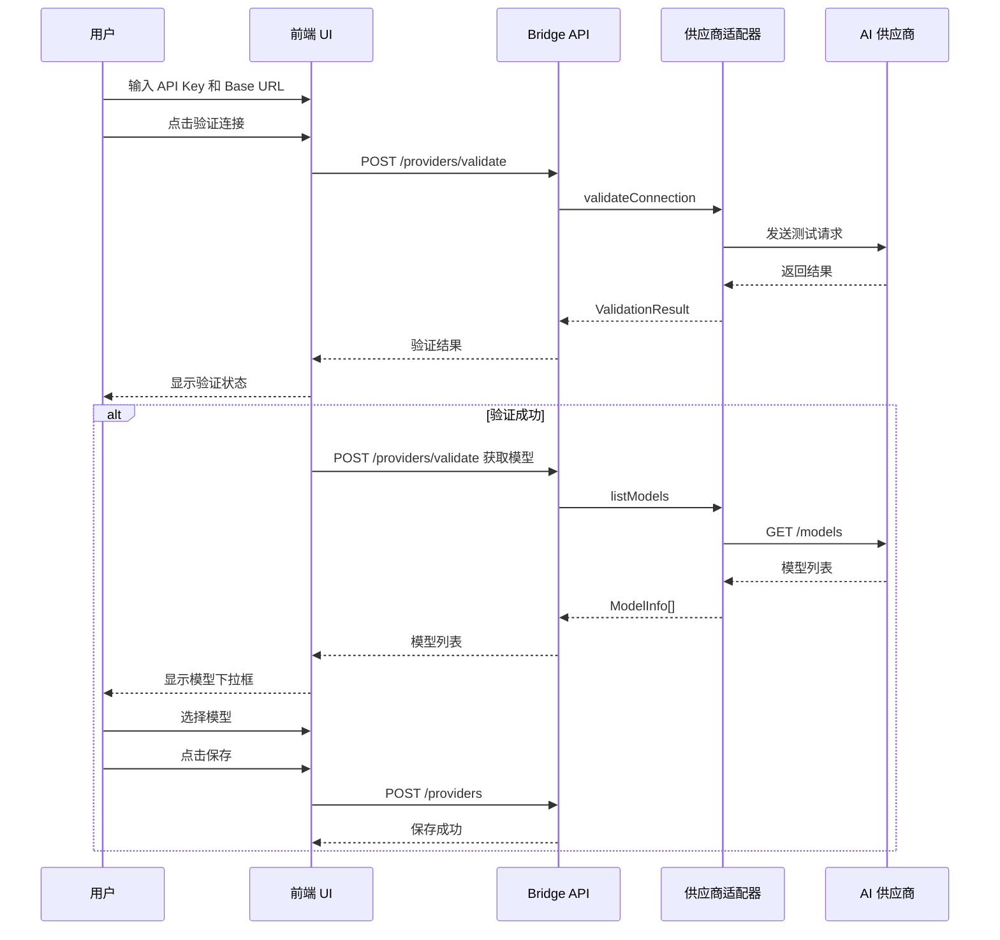
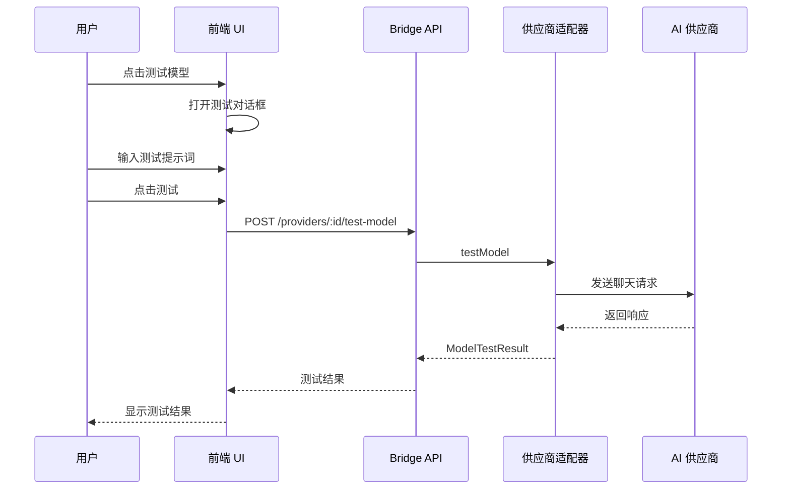
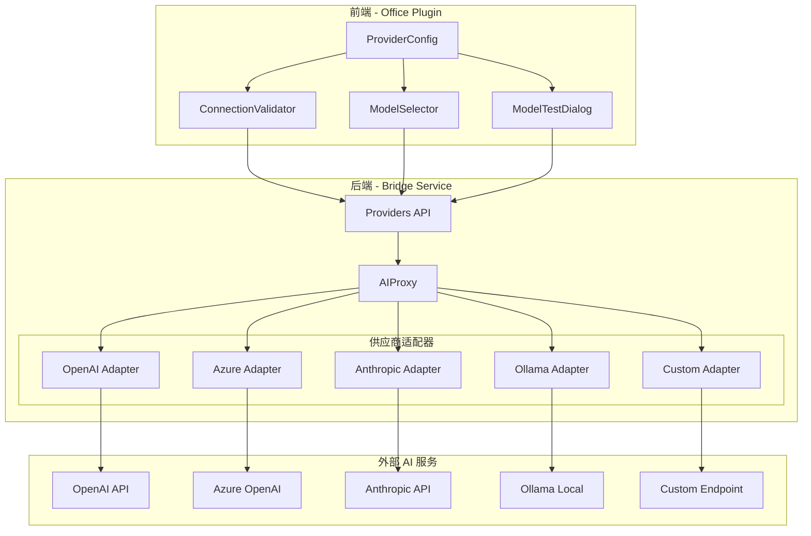

# AI 供应商模型自动获取和验证功能设计

## 1. 功能概述

### 1.1 目标

改进 AI 供应商管理功能，提升用户体验：

1. **自动获取模型列表** - 添加供应商后自动从 API 获取可用模型
2. **模型选择优化** - 用户从下拉列表选择模型，而非手动输入
3. **连接验证** - 保存前验证 API Key 和 Base URL 的有效性
4. **模型测试** - 验证特定模型是否可用

### 1.2 用户体验改进

| 当前流程 | 改进后流程 |
|---------|-----------|
| 手动输入模型名称 | 从下拉列表选择模型 |
| 保存后才知道配置是否正确 | 保存前可验证连接 |
| 无法确认模型是否可用 | 可测试特定模型 |
| 不知道有哪些可用模型 | 自动显示可用模型列表 |

### 1.3 范围

- 后端：新增 3 个 API 端点，完善 5 个供应商适配器
- 前端：改进供应商配置表单，添加验证和测试功能

---

## 2. API 设计

### 2.1 新增 API 端点

#### 2.1.1 验证供应商配置（不保存）

```
POST /api/config/providers/validate
```

**用途**：在保存前验证 API Key 和 Base URL 是否有效

**请求体**：
```json
{
  "type": "openai",
  "apiKey": "sk-xxx",
  "baseUrl": "https://api.openai.com/v1"
}
```

**成功响应**：
```json
{
  "success": true,
  "data": {
    "valid": true,
    "latency": 234,
    "message": "连接成功"
  }
}
```

**失败响应**：
```json
{
  "success": false,
  "data": {
    "valid": false,
    "error": "Invalid API Key",
    "errorCode": "INVALID_API_KEY"
  }
}
```

**错误码**：
| 错误码 | 说明 |
|--------|------|
| INVALID_API_KEY | API Key 无效 |
| INVALID_BASE_URL | Base URL 无效或无法访问 |
| NETWORK_ERROR | 网络连接失败 |
| TIMEOUT | 请求超时 |
| UNKNOWN_ERROR | 未知错误 |

---

#### 2.1.2 获取可用模型列表

```
GET /api/config/providers/:id/models
```

**用途**：获取已保存供应商的可用模型列表

**成功响应**：
```json
{
  "success": true,
  "data": {
    "models": [
      {
        "id": "gpt-4o",
        "name": "GPT-4o",
        "description": "Most capable model",
        "contextWindow": 128000,
        "supportsVision": true,
        "supportsTools": true
      },
      {
        "id": "gpt-4o-mini",
        "name": "GPT-4o Mini",
        "description": "Fast and affordable",
        "contextWindow": 128000,
        "supportsVision": true,
        "supportsTools": true
      }
    ],
    "cached": false,
    "fetchedAt": 1703750400000
  }
}
```

**查询参数**：
| 参数 | 类型 | 说明 |
|------|------|------|
| refresh | boolean | 是否强制刷新缓存 |
| filter | string | 过滤模型名称 |

---

#### 2.1.3 测试特定模型

```
POST /api/config/providers/:id/test-model
```

**用途**：测试特定模型是否可用

**请求体**：
```json
{
  "modelId": "gpt-4o",
  "testPrompt": "Hello"
}
```

**成功响应**：
```json
{
  "success": true,
  "data": {
    "available": true,
    "latency": 456,
    "response": "Hello! How can I help you today?"
  }
}
```

**失败响应**：
```json
{
  "success": false,
  "data": {
    "available": false,
    "error": "Model not found or access denied",
    "errorCode": "MODEL_NOT_AVAILABLE"
  }
}
```

---

### 2.2 现有 API 增强

#### 2.2.1 增强 POST /api/config/providers/:id/test

在现有测试连接 API 中增加返回模型列表：

```json
{
  "success": true,
  "data": {
    "connected": true,
    "latency": 234,
    "availableModels": ["gpt-4o", "gpt-4o-mini", "gpt-3.5-turbo"],
    "modelDetails": [
      {
        "id": "gpt-4o",
        "name": "GPT-4o",
        "contextWindow": 128000
      }
    ]
  }
}
```

---

## 3. 供应商适配器改进

### 3.1 适配器接口扩展

在 [`office-local-bridge/src/proxy/types.ts`](office-local-bridge/src/proxy/types.ts:119) 中扩展 `AIProviderAdapter` 接口：

```typescript
export interface AIProviderAdapter {
  name: AIProvider
  
  chatCompletion(config: AIRequestConfig, request: ChatCompletionRequest): Promise<ChatCompletionResponse>
  
  chatCompletionStream(config: AIRequestConfig, request: ChatCompletionRequest): AsyncGenerator<ChatCompletionChunk, void, unknown>
  
  // 获取可用模型列表
  listModels?(config: AIRequestConfig): Promise<ModelInfo[]>
  
  // 新增：验证连接
  validateConnection?(config: AIRequestConfig): Promise<ValidationResult>
  
  // 新增：测试模型
  testModel?(config: AIRequestConfig, modelId: string): Promise<ModelTestResult>
}

// 新增类型
export interface ValidationResult {
  valid: boolean
  latency: number
  error?: string
  errorCode?: string
}

export interface ModelTestResult {
  available: boolean
  latency: number
  response?: string
  error?: string
  errorCode?: string
}
```

### 3.2 各供应商实现方案

#### 3.2.1 OpenAI 适配器 ✅ 已实现

**文件**：[`office-local-bridge/src/proxy/providers/openai.ts`](office-local-bridge/src/proxy/providers/openai.ts:127)

**现有实现**：
- `listModels`: 调用 `GET /models`，过滤 `gpt-` 开头的模型

**需要增强**：
- 添加 `validateConnection` 方法
- 添加 `testModel` 方法
- 增加模型元数据（contextWindow, supportsVision 等）

```typescript
// 模型元数据预设
const MODEL_METADATA: Record<string, Partial<ModelInfo>> = {
  'gpt-4o': { contextWindow: 128000, supportsVision: true, supportsTools: true },
  'gpt-4o-mini': { contextWindow: 128000, supportsVision: true, supportsTools: true },
  'gpt-4-turbo': { contextWindow: 128000, supportsVision: true, supportsTools: true },
  'gpt-3.5-turbo': { contextWindow: 16385, supportsVision: false, supportsTools: true }
}
```

---

#### 3.2.2 Azure OpenAI 适配器 ❌ 需实现

**文件**：[`office-local-bridge/src/proxy/providers/azure.ts`](office-local-bridge/src/proxy/providers/azure.ts:21)

**API 端点**：`GET {baseUrl}/openai/deployments?api-version={version}`

**实现方案**：
```typescript
async listModels(config: AIRequestConfig): Promise<ModelInfo[]> {
  const apiVersion = config.azureApiVersion || '2024-02-15-preview'
  const url = `${config.baseUrl}/openai/deployments?api-version=${apiVersion}`
  
  const response = await fetch(url, {
    headers: { 'api-key': config.apiKey }
  })
  
  const data = await response.json()
  return data.data.map((deployment: any) => ({
    id: deployment.id,
    name: deployment.model,
    description: `Azure deployment: ${deployment.id}`
  }))
}
```

**注意事项**：
- Azure 返回的是部署列表，不是模型列表
- 需要用户配置 `azureDeployment` 而非选择模型

---

#### 3.2.3 Anthropic 适配器 ❌ 需实现

**文件**：[`office-local-bridge/src/proxy/providers/anthropic.ts`](office-local-bridge/src/proxy/providers/anthropic.ts:82)

**API 端点**：Anthropic 没有官方的模型列表 API

**实现方案**：使用预设模型列表

```typescript
const ANTHROPIC_MODELS: ModelInfo[] = [
  {
    id: 'claude-3-5-sonnet-20241022',
    name: 'Claude 3.5 Sonnet',
    description: 'Most intelligent model',
    contextWindow: 200000,
    supportsVision: true,
    supportsTools: true
  },
  {
    id: 'claude-3-5-haiku-20241022',
    name: 'Claude 3.5 Haiku',
    description: 'Fastest model',
    contextWindow: 200000,
    supportsVision: true,
    supportsTools: true
  },
  {
    id: 'claude-3-opus-20240229',
    name: 'Claude 3 Opus',
    description: 'Powerful model for complex tasks',
    contextWindow: 200000,
    supportsVision: true,
    supportsTools: true
  }
]

async listModels(_config: AIRequestConfig): Promise<ModelInfo[]> {
  return ANTHROPIC_MODELS
}
```

---

#### 3.2.4 Ollama 适配器 ❌ 需创建

**新文件**：`office-local-bridge/src/proxy/providers/ollama.ts`

**API 端点**：`GET http://localhost:11434/api/tags`

**实现方案**：
```typescript
export class OllamaAdapter implements AIProviderAdapter {
  name = 'ollama' as const
  
  async listModels(config: AIRequestConfig): Promise<ModelInfo[]> {
    const baseUrl = config.baseUrl || 'http://localhost:11434'
    const url = `${baseUrl}/api/tags`
    
    const response = await fetch(url)
    const data = await response.json()
    
    return data.models.map((model: any) => ({
      id: model.name,
      name: model.name,
      description: `Size: ${formatBytes(model.size)}`,
      contextWindow: model.details?.context_length
    }))
  }
  
  // Ollama 使用 OpenAI 兼容 API
  async chatCompletion(config: AIRequestConfig, request: ChatCompletionRequest) {
    const baseUrl = config.baseUrl || 'http://localhost:11434'
    const url = `${baseUrl}/v1/chat/completions`
    // ... 实现类似 OpenAI
  }
}
```

---

#### 3.2.5 Custom 适配器 ⚠️ 部分支持

**文件**：[`office-local-bridge/src/proxy/providers/custom.ts`](office-local-bridge/src/proxy/providers/custom.ts:20)

**实现方案**：假设兼容 OpenAI API

```typescript
async listModels(config: AIRequestConfig): Promise<ModelInfo[]> {
  if (!config.baseUrl) {
    return []
  }
  
  const url = `${config.baseUrl}/models`
  
  try {
    const response = await fetch(url, {
      headers: {
        'Authorization': `Bearer ${config.apiKey}`,
        ...config.customHeaders
      }
    })
    
    if (!response.ok) {
      logger.warn('Custom endpoint does not support /models')
      return []
    }
    
    const data = await response.json()
    return data.data?.map((model: any) => ({
      id: model.id,
      name: model.id
    })) || []
  } catch {
    return []
  }
}
```

---

### 3.3 适配器实现状态汇总

| 供应商 | listModels | validateConnection | testModel | API 端点 |
|--------|------------|-------------------|-----------|----------|
| OpenAI | ✅ 已实现 | ❌ 需实现 | ❌ 需实现 | GET /models |
| Azure | ❌ 需实现 | ❌ 需实现 | ❌ 需实现 | GET /openai/deployments |
| Anthropic | ❌ 需实现 | ❌ 需实现 | ❌ 需实现 | 预设列表 |
| Ollama | ❌ 需创建 | ❌ 需创建 | ❌ 需创建 | GET /api/tags |
| Custom | ❌ 需实现 | ❌ 需实现 | ❌ 需实现 | GET /models（假设） |

---

## 4. 前端 UI 改进方案

### 4.1 供应商配置表单改进

#### 4.1.1 添加验证按钮

在 API Key 和 Base URL 输入框旁添加「验证连接」按钮：

```
┌─────────────────────────────────────────────────────────┐
│ API Key                                                 │
│ ┌─────────────────────────────────────┐ ┌────────────┐ │
│ │ sk-xxx...                           │ │ 验证连接   │ │
│ └─────────────────────────────────────┘ └────────────┘ │
│                                                         │
│ Base URL                                                │
│ ┌─────────────────────────────────────────────────────┐ │
│ │ https://api.openai.com/v1                           │ │
│ └─────────────────────────────────────────────────────┘ │
│                                                         │
│ ✅ 连接成功 (延迟: 234ms)                               │
└─────────────────────────────────────────────────────────┘
```

#### 4.1.2 模型选择下拉框

将模型输入框改为下拉选择框：

```
┌─────────────────────────────────────────────────────────┐
│ 默认模型                                                │
│ ┌─────────────────────────────────────┐ ┌────────────┐ │
│ │ ▼ gpt-4o                            │ │ 刷新列表   │ │
│ ├─────────────────────────────────────┤ └────────────┘ │
│ │ ○ gpt-4o          (128K, Vision)    │                │
│ │ ● gpt-4o-mini     (128K, Vision)    │                │
│ │ ○ gpt-4-turbo     (128K, Vision)    │                │
│ │ ○ gpt-3.5-turbo   (16K)             │                │
│ └─────────────────────────────────────┘                │
│                                                         │
│ ┌────────────┐                                          │
│ │ 测试模型   │                                          │
│ └────────────┘                                          │
└─────────────────────────────────────────────────────────┘
```

#### 4.1.3 模型测试对话框

点击「测试模型」后显示测试对话框：

```
┌─────────────────────────────────────────────────────────┐
│ 测试模型: gpt-4o                              [×]       │
├─────────────────────────────────────────────────────────┤
│                                                         │
│ 测试提示词:                                             │
│ ┌─────────────────────────────────────────────────────┐ │
│ │ Hello, please respond with OK                       │ │
│ └─────────────────────────────────────────────────────┘ │
│                                                         │
│ 响应:                                                   │
│ ┌─────────────────────────────────────────────────────┐ │
│ │ OK                                                  │ │
│ └─────────────────────────────────────────────────────┘ │
│                                                         │
│ ✅ 模型可用 (延迟: 456ms)                               │
│                                                         │
│                              ┌────────┐ ┌────────────┐  │
│                              │ 关闭   │ │ 重新测试   │  │
│                              └────────┘ └────────────┘  │
└─────────────────────────────────────────────────────────┘
```

### 4.2 状态指示器

添加连接状态指示器：

| 状态 | 图标 | 颜色 | 说明 |
|------|------|------|------|
| unknown | ○ | 灰色 | 未测试 |
| validating | ◐ | 蓝色 | 验证中 |
| connected | ● | 绿色 | 连接成功 |
| error | ● | 红色 | 连接失败 |

### 4.3 组件结构

```
ProviderConfig/
├── ProviderForm.tsx          # 供应商配置表单
├── ConnectionValidator.tsx   # 连接验证组件
├── ModelSelector.tsx         # 模型选择下拉框
├── ModelTestDialog.tsx       # 模型测试对话框
└── StatusIndicator.tsx       # 状态指示器
```

---

## 5. 数据流程图

### 5.1 添加供应商流程



### 5.2 测试模型流程



### 5.3 系统架构图



---

## 6. 实现优先级

### 阶段一：核心功能

1. **实现 validate API** - `POST /api/config/providers/validate`
2. **实现 models API** - `GET /api/config/providers/:id/models`
3. **完善 OpenAI 适配器** - 添加 validateConnection 和模型元数据
4. **实现 Anthropic 适配器** - listModels 使用预设列表
5. **前端：连接验证组件** - ConnectionValidator

### 阶段二：扩展支持

6. **实现 Azure 适配器** - listModels 获取部署列表
7. **创建 Ollama 适配器** - 完整实现
8. **实现 Custom 适配器** - listModels 尝试获取
9. **前端：模型选择组件** - ModelSelector

### 阶段三：测试功能

10. **实现 test-model API** - `POST /api/config/providers/:id/test-model`
11. **各适配器实现 testModel** - 发送简单请求验证
12. **前端：模型测试对话框** - ModelTestDialog

### 阶段四：优化完善

13. **模型列表缓存** - 避免频繁请求
14. **错误处理优化** - 友好的错误提示
15. **UI 状态管理** - 加载、错误、成功状态

---

## 7. 文件修改清单

### 7.1 后端文件

| 文件 | 操作 | 说明 |
|------|------|------|
| `src/proxy/types.ts` | 修改 | 添加 ValidationResult, ModelTestResult 类型 |
| `src/proxy/providers/openai.ts` | 修改 | 添加 validateConnection, testModel, 模型元数据 |
| `src/proxy/providers/azure.ts` | 修改 | 实现 listModels, validateConnection, testModel |
| `src/proxy/providers/anthropic.ts` | 修改 | 实现 listModels, validateConnection, testModel |
| `src/proxy/providers/ollama.ts` | 新建 | 创建 Ollama 适配器 |
| `src/proxy/providers/custom.ts` | 修改 | 实现 listModels, validateConnection, testModel |
| `src/proxy/providers/index.ts` | 修改 | 注册 Ollama 适配器 |
| `src/api/providers.ts` | 修改 | 添加 validate, models, test-model 端点 |

### 7.2 前端文件

| 文件 | 操作 | 说明 |
|------|------|------|
| `components/settings/ProviderConfig.tsx` | 修改 | 集成新组件 |
| `components/settings/ConnectionValidator.tsx` | 新建 | 连接验证组件 |
| `components/settings/ModelSelector.tsx` | 新建 | 模型选择组件 |
| `components/settings/ModelTestDialog.tsx` | 新建 | 模型测试对话框 |
| `components/settings/StatusIndicator.tsx` | 新建 | 状态指示器 |
| `services/api/providers.ts` | 修改 | 添加新 API 调用方法 |

---

## 8. 注意事项

### 8.1 安全性

- API Key 在传输时使用 HTTPS
- 验证 API 不保存任何敏感信息
- 前端不缓存 API Key 明文

### 8.2 性能

- 模型列表缓存 5 分钟
- 验证请求超时 10 秒
- 测试请求超时 30 秒

### 8.3 兼容性

- 保持现有 API 向后兼容
- 新功能为可选增强
- 支持手动输入模型名称作为备选

### 8.4 错误处理

- 网络错误提供重试选项
- API 错误显示详细信息
- 超时错误提示检查网络
