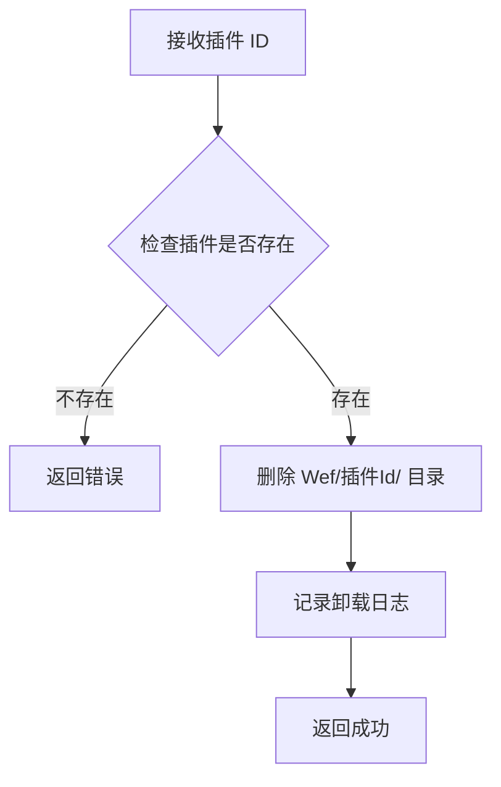
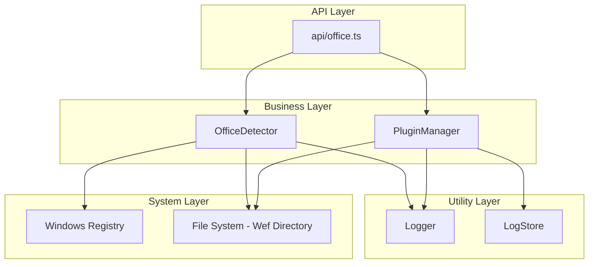

# Office 插件管理功能架构设计

## 1. 概述

本文档设计 office-local-bridge 项目的 Office 插件管理功能，包括 Office 环境检测、插件状态管理、一键安装/卸载和日志查看功能。

**目标平台**: Windows 10+  
**技术栈**: Node.js (ESM), TypeScript, Express.js

---

## 2. 模块结构设计

### 2.1 新增文件结构

```
office-local-bridge/src/
├── office/                      # Office 功能模块目录
│   ├── index.ts                 # 模块导出
│   ├── OfficeDetector.ts        # Office 环境检测
│   ├── PluginManager.ts         # 插件管理
│   └── types.ts                 # Office 相关类型定义
└── api/
    └── office.ts                # Office API 路由
```

### 2.2 模块职责划分

| 模块 | 职责 |
|------|------|
| `OfficeDetector` | 检测 Windows 系统上的 Office 版本、安装路径、已安装应用列表 |
| `PluginManager` | 管理 Office 插件的安装、卸载、状态查询、日志收集 |
| `api/office.ts` | 提供 RESTful API 端点供前端调用 |

---

## 3. Office 环境检测功能设计

### 3.1 技术方案

Windows 下通过**注册表检测** Office 安装信息：

**主要注册表路径**:
- `HKEY_LOCAL_MACHINE\SOFTWARE\Microsoft\Office\ClickToRun\Configuration`
  - `ProductReleaseIds`: 产品 ID 列表（如 `O365ProPlusRetail`）
  - `VersionToReport`: 详细版本号（如 `16.0.17928.20114`）
  - `InstallationPath`: 安装路径

**备用注册表路径**:
- `HKEY_LOCAL_MACHINE\SOFTWARE\Microsoft\Office\16.0\Common\InstallRoot`
- `HKEY_LOCAL_MACHINE\SOFTWARE\WOW6432Node\Microsoft\Office\16.0\Common\InstallRoot`

### 3.2 检测信息

| 信息项 | 说明 | 来源 |
|--------|------|------|
| productName | 产品名称（如 Microsoft 365, Office 2021） | 从 ProductReleaseIds 推断 |
| version | 详细版本号 | VersionToReport |
| installPath | 安装路径 | InstallationPath |
| apps | 已安装应用列表 | 检查 exe 文件是否存在 |

### 3.3 应用检测

通过检查安装目录下的可执行文件判断应用是否安装：

| 应用 | 可执行文件 |
|------|------------|
| Word | `WINWORD.EXE` |
| Excel | `EXCEL.EXE` |
| PowerPoint | `POWERPNT.EXE` |
| Outlook | `OUTLOOK.EXE` |
| OneNote | `ONENOTE.EXE` |

### 3.4 OfficeDetector 类设计

```typescript
class OfficeDetector {
  // 检测完整环境信息（带缓存）
  async detectEnvironment(): Promise<OfficeEnvironment>
  
  // 获取 Office 版本信息
  async getVersion(): Promise<OfficeVersionInfo | null>
  
  // 获取已安装应用列表
  async getInstalledApps(): Promise<OfficeApp[]>
  
  // 检查 Office 是否已安装
  async isInstalled(): Promise<boolean>
  
  // 清除检测缓存
  clearCache(): void
}
```

---

## 4. Office 插件管理功能设计

### 4.1 插件安装机制

Office Add-in 使用基于 `manifest.xml` 的 sideload 方式安装。

**Windows 信任目录位置**:
```
%LOCALAPPDATA%\Microsoft\Office\16.0\Wef\
```

**目录结构**:
```
Wef/
├── {manifest-id-1}/
│   └── manifest.xml
├── {manifest-id-2}/
│   └── manifest.xml
└── ...
```

### 4.2 安装流程


### 4.3 卸载流程



### 4.4 插件状态检测

扫描信任目录获取已安装插件列表，解析每个 manifest.xml 提取信息：

| 字段 | manifest 元素 |
|------|---------------|
| id | `<Id>` |
| name | `<DisplayName>` |
| version | `<Version>` |
| provider | `<ProviderName>` |
| description | `<Description>` |
| supportedHosts | `<Hosts>` |

### 4.5 PluginManager 类设计

```typescript
class PluginManager extends EventEmitter {
  // 获取信任目录路径
  getTrustDirectory(): string
  
  // 列出所有已安装插件
  async listPlugins(): Promise<OfficePlugin[]>
  
  // 获取指定插件状态
  async getPlugin(id: string): Promise<OfficePlugin | null>
  
  // 安装插件
  async install(manifestPath: string): Promise<PluginInstallResult>
  
  // 卸载插件
  async uninstall(id: string): Promise<boolean>
  
  // 验证 manifest 文件
  async validateManifest(path: string): Promise<ManifestValidation>
  
  // 获取插件日志
  getPluginLogs(id: string, options?: LogOptions): LogEntry[]
}
```

---

## 5. API 端点设计

### 5.1 端点列表

| 方法 | 路径 | 说明 |
|------|------|------|
| GET | `/api/office/environment` | 获取 Office 环境信息 |
| GET | `/api/office/apps` | 获取已安装的 Office 应用列表 |
| GET | `/api/office/plugins` | 获取所有已安装的 Office 插件 |
| GET | `/api/office/plugins/:id` | 获取指定插件详情 |
| POST | `/api/office/plugins/install` | 安装插件 |
| DELETE | `/api/office/plugins/:id` | 卸载插件 |
| GET | `/api/office/plugins/:id/logs` | 获取插件日志 |

### 5.2 端点详细设计

#### GET /api/office/environment

获取 Office 环境信息。

**响应**:
```json
{
  "success": true,
  "data": {
    "installed": true,
    "productName": "Microsoft 365",
    "version": "16.0.17928.20114",
    "installPath": "C:\\Program Files\\Microsoft Office\\root\\Office16",
    "apps": [
      { "name": "Word", "installed": true, "path": "...\\WINWORD.EXE" },
      { "name": "Excel", "installed": true, "path": "...\\EXCEL.EXE" },
      { "name": "PowerPoint", "installed": true, "path": "...\\POWERPNT.EXE" }
    ],
    "trustDirectory": "C:\\Users\\xxx\\AppData\\Local\\Microsoft\\Office\\16.0\\Wef"
  }
}
```

#### GET /api/office/apps

获取已安装的 Office 应用列表。

**响应**:
```json
{
  "success": true,
  "data": {
    "apps": [
      { "name": "Word", "installed": true, "path": "...\\WINWORD.EXE" },
      { "name": "Excel", "installed": true, "path": "...\\EXCEL.EXE" },
      { "name": "PowerPoint", "installed": true, "path": "...\\POWERPNT.EXE" }
    ]
  }
}
```

#### GET /api/office/plugins

获取所有已安装的 Office 插件。

**响应**:
```json
{
  "success": true,
  "data": {
    "plugins": [
      {
        "id": "xxxxxxxx-xxxx-xxxx-xxxx-xxxxxxxxxxxx",
        "name": "My Office Add-in",
        "version": "1.0.0",
        "provider": "Contoso",
        "description": "An Office Add-in",
        "manifestPath": "C:\\...\\Wef\\xxx\\manifest.xml",
        "supportedHosts": ["Word", "Excel"],
        "installedAt": 1703577600000
      }
    ]
  }
}
```

#### GET /api/office/plugins/:id

获取指定插件详情。

**响应**:
```json
{
  "success": true,
  "data": {
    "id": "xxxxxxxx-xxxx-xxxx-xxxx-xxxxxxxxxxxx",
    "name": "My Office Add-in",
    "version": "1.0.0",
    "provider": "Contoso",
    "description": "An Office Add-in",
    "manifestPath": "C:\\...\\Wef\\xxx\\manifest.xml",
    "supportedHosts": ["Word", "Excel"],
    "installedAt": 1703577600000
  }
}
```

**错误响应** (404):
```json
{
  "success": false,
  "error": "插件不存在: xxx"
}
```

#### POST /api/office/plugins/install

安装插件。

**请求体**:
```json
{
  "manifestPath": "/path/to/manifest.xml"
}
```

或支持上传文件（multipart/form-data）。

**响应**:
```json
{
  "success": true,
  "data": {
    "id": "xxxxxxxx-xxxx-xxxx-xxxx-xxxxxxxxxxxx",
    "name": "My Office Add-in",
    "version": "1.0.0",
    "message": "插件安装成功"
  }
}
```

**错误响应**:
```json
{
  "success": false,
  "error": "manifest.xml 验证失败: 缺少必需的 Id 元素"
}
```

#### DELETE /api/office/plugins/:id

卸载插件。

**响应**:
```json
{
  "success": true,
  "message": "插件已卸载: My Office Add-in"
}
```

#### GET /api/office/plugins/:id/logs

获取插件日志。

**查询参数**:
- `limit`: 返回的日志条数（默认 100）
- `level`: 日志级别过滤（debug/info/warn/error）

**响应**:
```json
{
  "success": true,
  "data": {
    "logs": [
      {
        "timestamp": 1703577600000,
        "level": "info",
        "module": "PluginManager",
        "message": "插件安装成功",
        "data": { "id": "xxx", "name": "My Add-in" }
      }
    ]
  }
}
```

---

## 6. 类型定义

### 6.1 Office 环境相关类型

```typescript
/**
 * Office 应用类型
 */
export type OfficeAppName = 'Word' | 'Excel' | 'PowerPoint' | 'Outlook' | 'OneNote'

/**
 * Office 应用信息
 */
export interface OfficeApp {
  name: OfficeAppName
  installed: boolean
  path?: string
}

/**
 * Office 版本信息
 */
export interface OfficeVersionInfo {
  productName: string
  version: string
  build?: string
}

/**
 * Office 环境信息
 */
export interface OfficeEnvironment {
  installed: boolean
  productName?: string
  version?: string
  installPath?: string
  apps: OfficeApp[]
  trustDirectory: string
  detectedAt: number
}
```

### 6.2 插件相关类型

```typescript
/**
 * 插件支持的宿主类型
 */
export type PluginHostType = 'Document' | 'Workbook' | 'Presentation' | 'Mailbox' | 'Notebook'

/**
 * Office 插件信息
 */
export interface OfficePlugin {
  id: string
  name: string
  version: string
  provider?: string
  description?: string
  manifestPath: string
  supportedHosts: PluginHostType[]
  installedAt: number
  sourceUrl?: string
  iconUrl?: string
}

/**
 * 插件安装请求
 */
export interface PluginInstallRequest {
  manifestPath?: string
  manifestContent?: string
}

/**
 * 插件安装结果
 */
export interface PluginInstallResult {
  success: boolean
  plugin?: OfficePlugin
  error?: string
}

/**
 * manifest 验证结果
 */
export interface ManifestValidation {
  valid: boolean
  errors: string[]
  warnings: string[]
  parsedInfo?: {
    id: string
    name: string
    version: string
    provider?: string
  }
}

/**
 * 日志查询选项
 */
export interface PluginLogOptions {
  limit?: number
  level?: 'debug' | 'info' | 'warn' | 'error'
  startTime?: number
  endTime?: number
}
```

---

## 7. 集成设计

### 7.1 server.ts 修改

在主入口文件中添加 Office 路由：

```typescript
import officeRouter from './api/office.js'

// 挂载 API 路由
app.use('/api/office', tokenAuth, officeRouter)
```

### 7.2 WebSocket 事件

插件状态变更时通过 WebSocket 广播：

| 事件类型 | 说明 |
|----------|------|
| `plugin:installed` | 插件安装完成 |
| `plugin:uninstalled` | 插件卸载完成 |
| `plugin:error` | 插件操作错误 |

---

## 8. 模块架构图



---

## 9. 实现注意事项

1. **注册表访问**: 使用 `child_process.exec` 执行 `reg query` 命令读取注册表，避免引入额外的 npm 依赖。

2. **manifest 解析**: 使用 Node.js 内置的 XML 解析能力，可以通过正则表达式或简单的字符串处理提取关键信息，避免引入重量级 XML 库。

3. **缓存策略**: OfficeDetector 应实现检测结果缓存，避免频繁的注册表和文件系统访问。

4. **错误处理**: 所有文件系统操作应有完善的错误处理，特别是权限相关错误。

5. **日志记录**: 所有插件操作应记录到 LogStore，便于问题排查。

6. **代码风格**: 遵循现有项目的代码风格：
   - 使用 `createLogger` 创建模块日志器
   - 导出单例实例
   - API 路由使用 Express Router
   - 使用 JSDoc 注释

---

## 10. 后续扩展

1. **插件更新检测**: 对比本地版本与源版本
2. **批量操作**: 支持批量安装/卸载
3. **插件仓库**: 集成插件仓库，支持从仓库搜索和安装
4. **Mac 平台支持**: 扩展到 macOS 平台的 Office 插件管理
